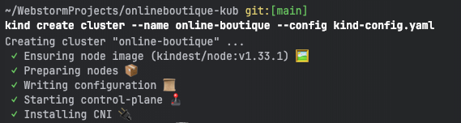
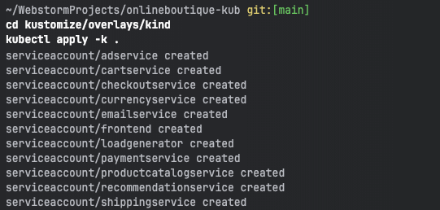
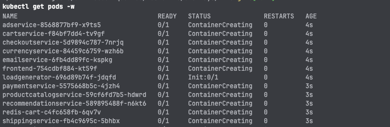
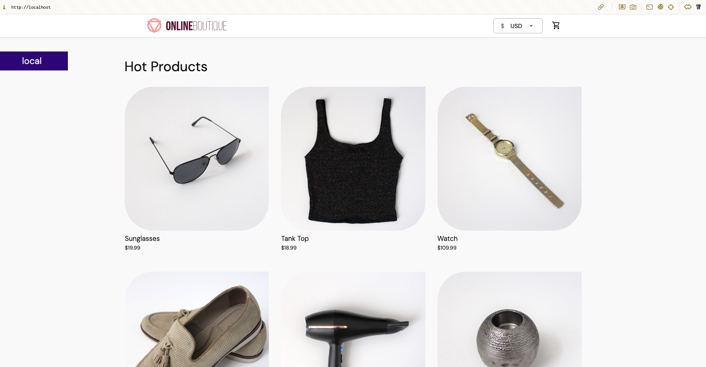
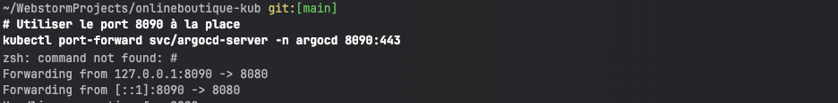
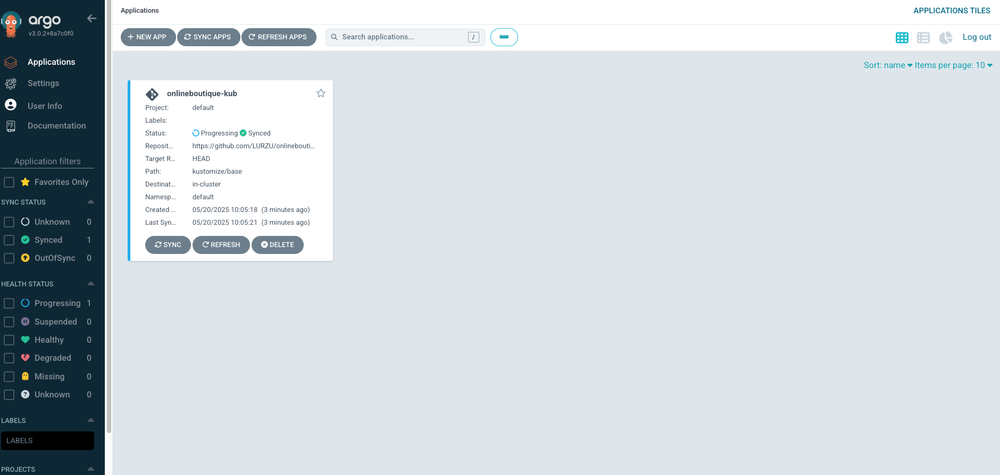
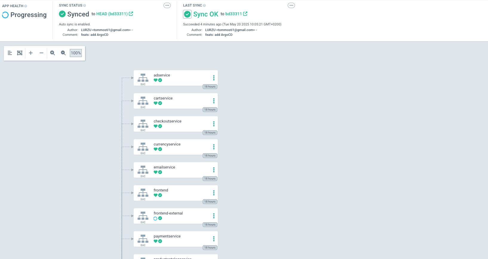

# Déploiement d'Online Boutique sur Kind avec Kustomize

Ce document détaille les étapes que nous avons suivies pour déployer l'application "Online Boutique" sur un cluster Kubernetes local avec Kind, en utilisant Kustomize pour gérer les configurations.

## Étape 1 : Création du cluster Kind

```bash
kind create cluster --name online-boutique --config kind-config.yaml
```



Le fichier `kind-config.yaml` configurait le cluster avec des paramètres personnalisés, notamment l'exposition des ports pour permettre l'accès à l'application depuis l'extérieur du cluster.


## Étape 2 : Configuration Kustomize et déploiement


```bash
cd kustomize/overlays/kind
kubectl apply -k .
```



Cette commande a créé les comptes de service nécessaires pour chacun des microservices de l'application.

## Étape 3 : Configuration Kustomize et déploiement

```bash
kubectl get pods -w
```



## Étape 4 : Vérification de l'accès à l'application





# ARGOCD


## Étape 1 : Installation d'ArgoCD

```bash
kubectl create namespace argocd
kubectl apply -n argocd -f https://raw.githubusercontent.com/argoproj/argo-cd/stable/manifests/install.yaml
```


## Étape 2 : Exposition du service ArgoCD

```bash
kubectl port-forward svc/argocd-server -n argocd 8080:443
```



## Étape 3 : Accès à l'interface web d'ArgoCD




## Étape 4 : Création de l'application ArgoCD


